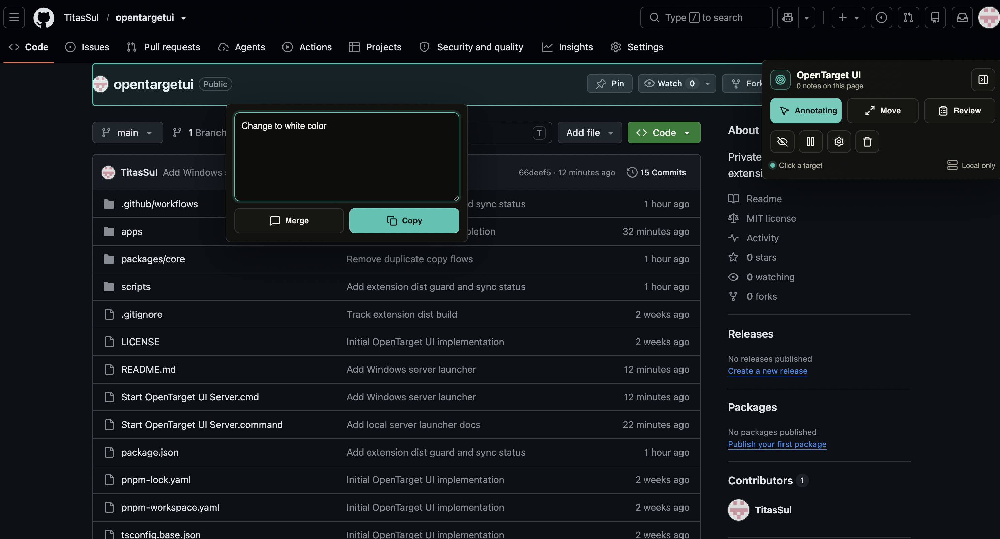
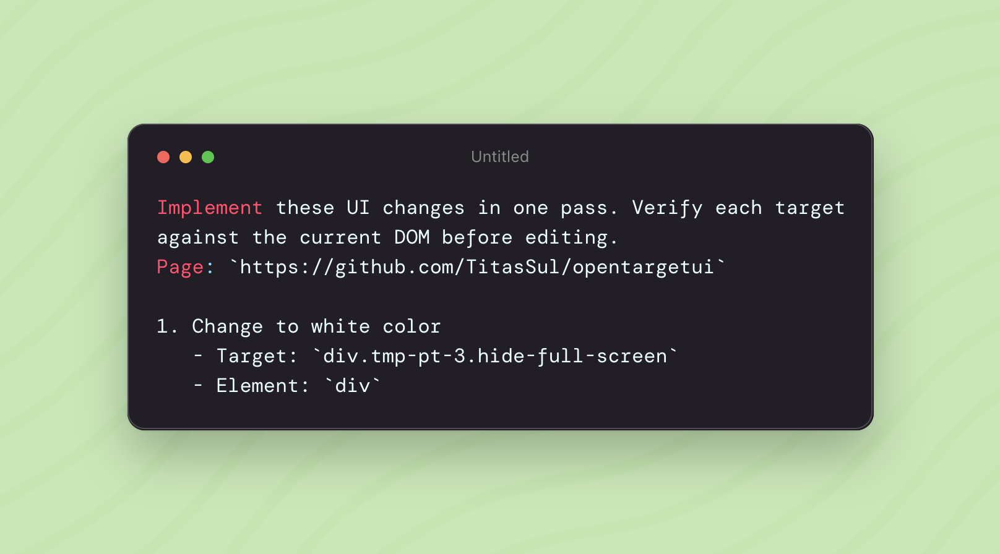

# OpenTarget UI

OpenTarget UI is an MIT-licensed browser extension for giving precise visual feedback to AI coding agents. It lets you mark elements on a live page, copy focused change requests from the annotation popup, create move requests, and optionally sync saved annotations to a local server that MCP-capable agents can read.

This is a clean-room implementation. It is feature-compatible with the public idea of structured UI feedback, but it does not copy Agentation source code, branding, assets, or interface text.



**Before copying UI changes from a selected DOM element**



## What ships in v0.1

- Chrome/Edge Manifest V3 extension.
- Popup-launched page overlay that stays hidden until enabled on the active tab.
- Annotate mode with text selection support.
- Annotation composer with `Merge` for saving to the page batch and `Copy` for copying one drafted annotation without saving a marker.
- Move mode for selecting an element, clicking a destination, saving the move request, and copying that move request to the clipboard.
- Review batch panel for editing, deleting, or clearing the current page changes.
- Local page storage through `chrome.storage.local`.
- LLM-ready change-request markdown, with compact, standard, detailed, and forensic context levels.
- Optional local sync/MCP bridge server on `http://localhost:4747`, with visible connection health in the toolbar.
- MCP tools for agents to list, acknowledge, resolve, dismiss, reply to, and watch annotations.

## Use the extension

Load the extension from `apps/extension/dist`:

1. Open `chrome://extensions` or `edge://extensions`.
2. Enable developer mode.
3. Click "Load unpacked".
4. Select `apps/extension/dist`.

Do not load the repository root or `apps/extension/src`; Chrome and Edge need the built `dist` folder.

No build step is needed just to load the extension because the unpacked extension bundle is committed in `apps/extension/dist`.

## Extension usage

1. Click the OpenTarget UI browser action and choose `Show UI`.
2. Use `Annotate` to click a target or select text on the page.
3. In the annotation popup, choose `Merge` to save it into the page batch or `Copy` to copy only that one drafted annotation.
4. Use `Move` to click an element, then click its destination. The completed move request is saved and copied.
5. Use `Review` to edit, delete, or clear saved page changes.

## Turn on local sync / MCP bridge

Double-click the launcher for your operating system:

```txt
macOS:   Start OpenTarget UI Server.command
Windows: Start OpenTarget UI Server.cmd
```

Plain English: this turns on the local OpenTarget backend. Keep the Terminal or Command Prompt window open, then enable Sync in the extension settings. After that, saved annotations are available to the local server and to MCP tools configured for this repo.

The launcher installs dependencies if needed, builds the local server, then starts `http://localhost:4747`.

Manual server commands:

```sh
pnpm install
pnpm build
pnpm server
```

Run the health check:

```sh
pnpm doctor
```

## Development

Verify source changes and the committed unpacked-extension bundle:

```sh
pnpm typecheck
pnpm test
pnpm check:extension-dist
```

## MCP usage

Point your MCP-capable coding agent at:

```sh
pnpm --filter @opentargetui/mcp-server mcp
```

For a packed install, use the package binary after building:

```sh
opentargetui-server mcp
```

## Repository layout

- `apps/extension` - Manifest V3 extension.
- `apps/mcp-server` - Local HTTP server and MCP stdio server.
- `packages/core` - Shared annotation types, selector utilities, and markdown formatter.

## Notes

OpenTarget UI keeps annotation data local by default. Server sync is opt-in from the extension settings panel.
